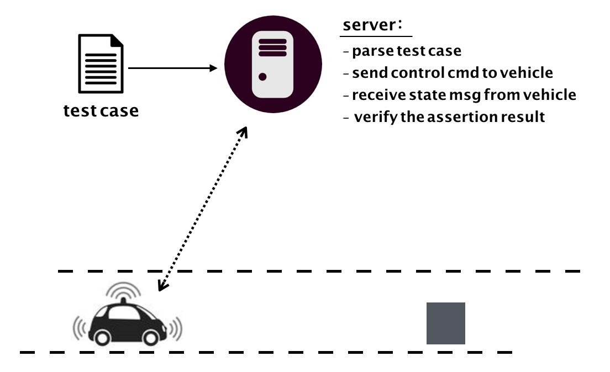
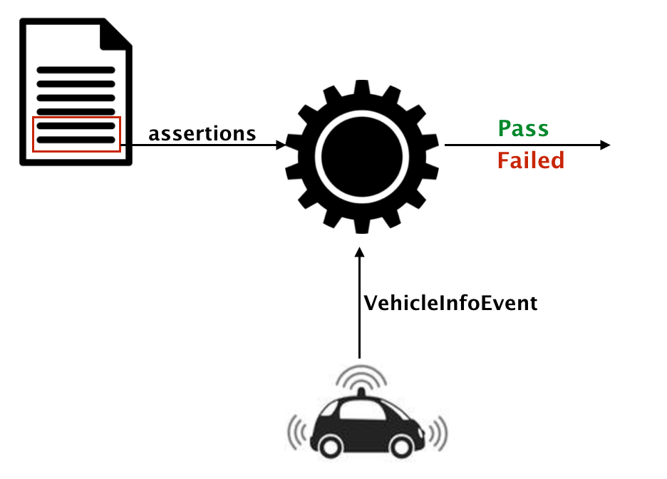

# Modern C++ Design

在C\++的世界里有一本神作，叫做《Modern C\++ Design》。这本书将C\++模板技术的使用带到了一个新境界，使看过的人都惊呼原来模板还可以这么玩。但也可能是因为这本书起名上的误导，让C\++背上了所谓设计就是玩弄语言晦涩语法的恶名。

关于什么是真正的软件设计，Kent Beck早就通过[简单设计原则](https://martinfowler.com/bliki/BeckDesignRules.html)进行了阐述。所谓好的软件设计，就是在保证正确实现软件的功能和非功能需求的基础上，还要让软件的长期维护成本更低，即要做到没有重复、易于理解和消除冗余。

反观C\++的主要应用领域，系统侧软件开发，由于需要兼顾更多的方面，如硬件、操作系统、性能、网络、相对高门槛的领域知识等等，导致做好设计会更加困难。然而这些年软件设计方法和技术的新发展，像敏捷软件开发、演进式设计、领域驱动设计、DCI架构、微服务等等，伴随这些概念出现的书或者源代码大都采用更加贴近于应用侧的编程语言，无形中又拉大了和C\++程序员之间的gap。

本文改编简化了一个真实C\++项目的软件设计开发过程，和大家分享一下我所认为的 **modern c\++ design** 。

## 问题

有一个智能电子玩具生产商，他们最新一代电动智能玩具汽车具有如下一些新功能：

- 可以通过遥控器设定玩具汽车沿着地面某条车道线行驶
- 可以根据遥控器的控制进行车道变换
- 行驶过程中如果发现前方有静止物体阻挡则会自动停车
- 行驶过程中如果发现前方有同方向低速移动物体则会自动跟随
- 其它特性

现在这家生产商想要对该产品开发一套测试系统，可以对该玩具汽车进行自动化的功能测试。目前玩具生产商已经有的是一套半自动测试环境，可以在电脑主机上提前编辑好对玩具汽车的遥控指令，然后通过wifi对实验场地上的玩具汽车下发这串控制指令。而玩具汽车在行驶过程中会每隔100ms将自身状态通过wifi上报给服务器，信息内容包含玩具车上各种传感器获取到的实时信息，例如当前的车速、和车道中心线的偏移距离以及和正前方物体的间距、是否发生碰撞等等。

对玩具车的行驶是否和预期一致的判断，原来是靠人工分析的。这样做不仅分析结果滞后而且效率低下。现在我们要做的是设计一套测试断言系统交给测试人员使用。作为一个完整的功能测试用例，测试人员需要为其编辑对应遥控指令，然后使用我们提供的断言描述玩具汽车应该有的行驶行为。最后测试用例在执行的时候会交给一台服务器，服务器通过解析测试用例的内容，给玩具汽车下发遥控指令，并实时接收玩具汽车的状态信息，持续判断玩具车在测试过程中的行驶行为是否和断言所预期的一致。

如上图所示，我们的程序主要跑在一台server上。程序需要解析测试用例，按照用例的描述给玩具汽车下发遥控指令，然后根据每100ms接收到的汽车状态信息去实时判断车的行驶状况是否和用例描述的断言一致。至于如何遥控汽车和接收汽车的状态信息，不是我们的关注点。我们把重点放在实现这套断言系统上。这里选择使用C\++语言来实现，或许是为了更容易与原来的C\++系统进行集成，或许是考虑到计算的实时性和性能等原因。但无论如何现在让我们开始把关注点放到对断言系统的设计和实现上。

## 演进式设计

为了尽快获得对设计的反馈，我们采用演进式设计。演进式设计会先针对已明确的高优先级和高技术风险的需求进行设计，开发和测试。这样可以对重要设计决策快速获得反馈结果，并顺便打通整个基础设施和技术栈。随后再迭代加入新的高优先级需求，对设计逐步进行演进。

演进式设计需要程序员和基础设施同时具有自动化测试和重构的能力，否则实施的成本就很高。另外，演进式设计和组合式设计相辅相承，让设计进行演进可以刺激构建易组合的软件组件，而保持软件组件的可组合性可以让设计演进的成本更低。

我们拿到如下测试人员希望最先支持的断言特性：

- 可以断言车辆在测试过程中没有发生过碰撞
- 可以断言车辆是否刹停

如下，在玩具汽车每100ms反馈的实时状态信息里，已经有了车辆是否碰撞以及当前速度的信息。

~~~cpp
struct VehicleInfoEvent
{
    int id;
    double speed;      // unit : m/s
    bool collision;    // if true : in collision state
    // ...
};
~~~

学过面向对象设计的话，就应该还记得面向对象的一个优势就在于容易对现实世界建模。于是能想到的一个设计就是实现一个`Vehicle`类，用来在软件中映射现实世界中的玩具汽车。`Vehicle`的对象可以一直接收`VehicleInfoEvent`消息并存储断言关注的信息，随后提供接口供断言判断。

OK，有了这个设计想法，那么写个测试用例描述一下吧。如果你熟悉TDD（测试驱动开发），那就再好不过了！先写测试会逼迫我们先来思考系统的边界在哪里。

我们的系统边界如下图：

1. 系统会接收玩具车测试人员所写的断言描述。
2. 系统会不断接收车辆状态信息。
3. 系统会输出断言成功或者失败的信息。

要写出第一个测试，得先设计出这三部分的接口。

对于1，我们可以提供给用户一套DSL(Domain-Specific Language)。但是[Martin Fowler](https://martinfowler.com/)在《[Domain-Specific Languages](https://martinfowler.com/books/dsl.html)》一书中明确说了，DSL只是对领域模型的一层封装而已，应该先有领域模型然后有DSL。所以我们暂时先把这层边界往内收一点，让`Vehicle`直接提供接口来响应我们的查询，

对于2，我们让`Vehicle`类有一个`processEvent(const VehicleInfoEvent& event)`接口，似乎就OK了。

对于3，我们让

下面假设我们搭建好了[gtest](https://github.com/google/googletest)测试环境。

~~~cpp
TEST(should_assert_no_collision)
{
}
~~~

## 领域建模

## 语义模型

## 领域专用语言

## 总结

